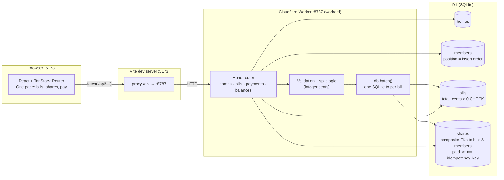
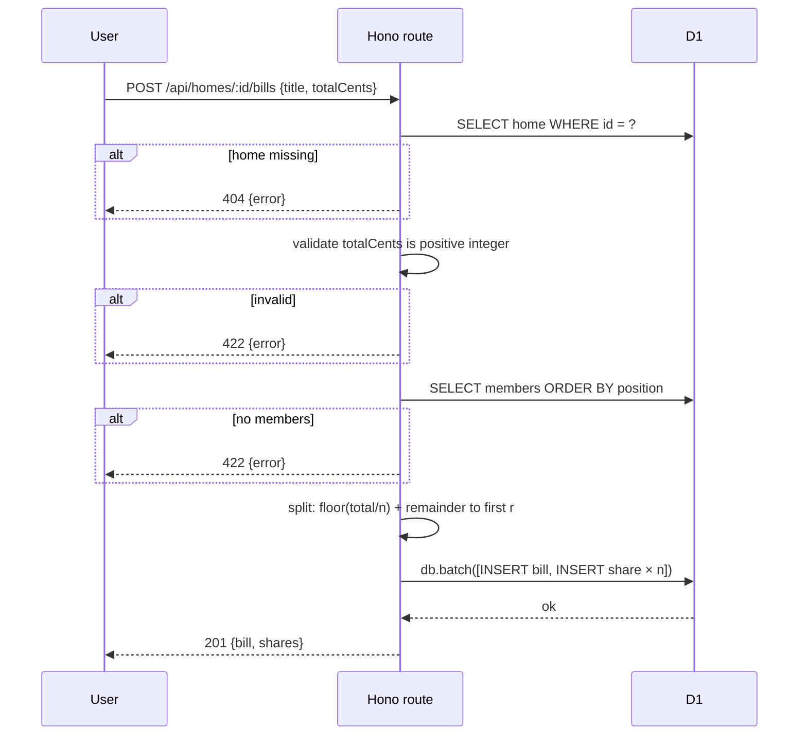

# Architecture

```mermaid
flowchart LR
    subgraph Client["Browser :5173"]
        UI["React + TanStack Router<br/>One page: bills, shares, pay"]
    end

    subgraph Vite["Vite dev server :5173"]
        Proxy["proxy /api → :8787"]
    end

    subgraph Worker["Cloudflare Worker :8787 (workerd)"]
        Hono["Hono router<br/>homes · bills · payments · balances"]
        Val["Validation + split logic<br/>(integer cents)"]
        Bat["db.batch()<br/>one SQLite tx per bill"]
    end

    subgraph D1["D1 (SQLite)"]
        direction TB
        H[(homes)]
        M[(members<br/>position = insert order)]
        B[(bills<br/>total_cents > 0 CHECK)]
        S[(shares<br/>composite FKs to bills & members<br/>paid_at ⟺ idempotency_key)]
    end

    UI -- "fetch('/api/...')" --> Proxy
    Proxy -- "HTTP" --> Hono
    Hono --> Val
    Val --> Bat
    Bat --> B
    Bat --> S
    Hono --> H
    Hono --> M
    Hono --> B
    Hono --> S
```

**Data flow (bill creation):**

```mermaid
sequenceDiagram
    participant U as User
    participant R as Hono route
    participant DB as D1

    U->>R: POST /api/homes/:id/bills {title, totalCents}
    R->>DB: SELECT home WHERE id = ?
    alt home missing
        R-->>U: 404 {error}
    end
    R->>R: validate totalCents is positive integer
    alt invalid
        R-->>U: 422 {error}
    end
    R->>DB: SELECT members ORDER BY position
    alt no members
        R-->>U: 422 {error}
    end
    R->>R: split: floor(total/n) + remainder to first r
    R->>DB: db.batch([INSERT bill, INSERT share × n])
    DB-->>R: ok
    R-->>U: 201 {bill, shares}
```